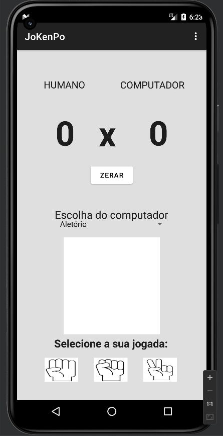
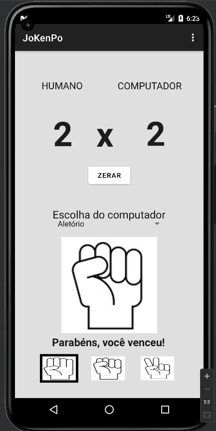
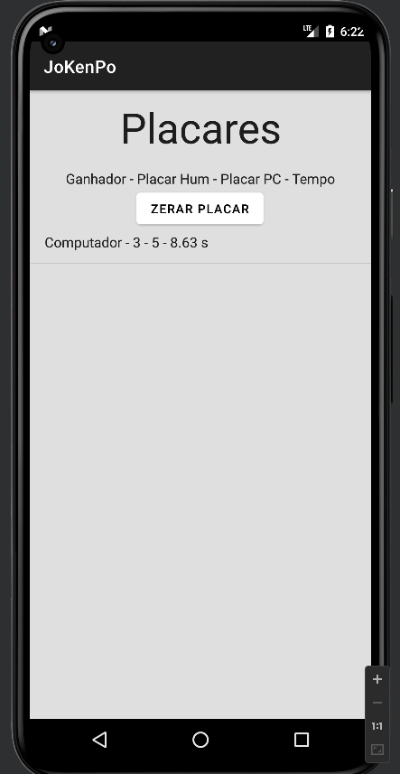
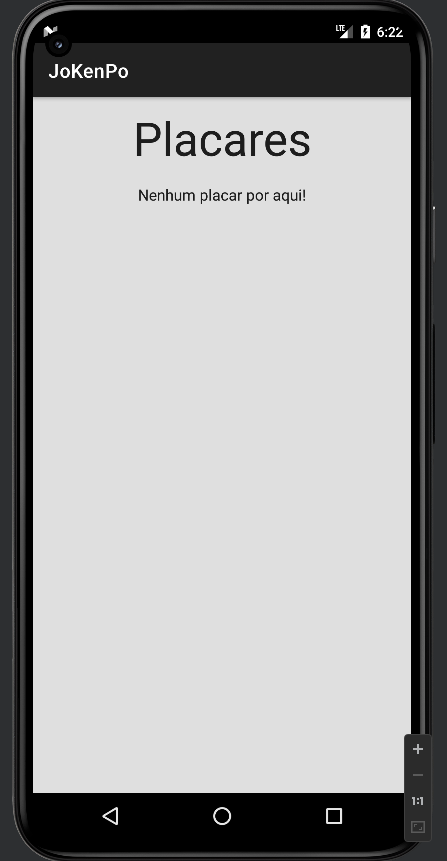

## JoKenPo

Aplicativo do jogo JoKenPo feito em Android.

Utiliza a biblioteca Room para persistência com o banco de dados para salvar, listar e apagar os ganhadores de cada partida.

## Imagens

  
  
  
  

